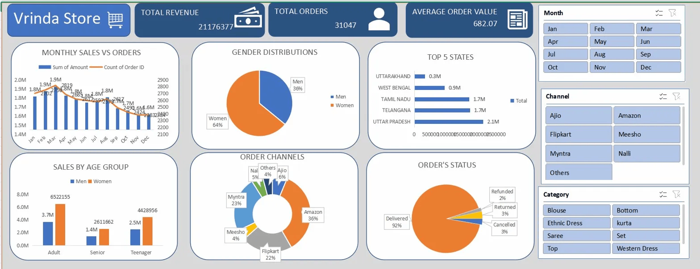

# 🛍️ Vrinda Store Annual Sales Analysis — Excel Dashboard

## 📌 Project Overview
An interactive Excel dashboard analyzing Vrinda Store's 2022 sales data
across major Indian e-commerce platforms (Amazon, Myntra, Flipkart, Ajio, Meesho, etc.).
Built as a data analytics project to explore real-world retail data.

## 🎯 Objective
To help Vrinda Store understand their 2022 performance by identifying
key customer segments, top-performing channels, and sales trends
to plan better strategies for growing revenue in 2023.

## 📊 Key Insights
- **Total Revenue:** ₹2,11,76,377 across all channels
- **Total Orders:** 31,047 orders processed in 2022
- **Average Order Value:** ₹682.07 per order
- **Who buys more?** Women account for ~64% of purchases vs Men at 36%
- **Top states:** Uttar Pradesh (₹2.1M), Telangana (₹1.7M), and Tamil Nadu (₹1.7M) lead sales
- **Best channels:** Amazon (36%) and Myntra (23%) and Flipkart (22%) contribute ~81% of orders
- **Top age group:** Adult women are the biggest buyers (₹65,22,155 in sales)
- **Delivery rate:** ~92% of orders were successfully delivered

## 🛠️ Process
1. **Raw Data** — Loaded Vrinda Store order data with multiple columns
2. **Data Cleaning** — Fixed inconsistencies, added `Month` and `Age Group` columns
3. **Analysis** — Built pivot tables for 6 key dimensions
4. **Dashboard** — Created interactive charts with slicers for Month, Channel, and Category

## 📁 File Structure
- `Vrinda_store_Analysis.xlsx`
  - `Vrinda Store Raw Data` — Original dataset
  - `Cleaned Data` — Processed dataset
  - `Dashboard` — Final visual interactive dashboard
  - Supporting sheets: Monthly Sales vs Orders, Gender Distribution, Top 5 States, Order Channels, Sales by Age Group, Order Status

## 📈 Dashboard Preview

## 🔧 Tools Used
- Microsoft Excel (Pivot Tables, Pivot Charts, Slicers, Data Cleaning)

## 📚 What I Learned
- Data cleaning in Excel (handling inconsistencies, deriving new columns like Month and Age Group)
- Building pivot tables and pivot charts for multi-dimensional analysis
- Designing an interactive dashboard with slicers (Month, Channel, Category)
- Drawing actionable business insights from raw transactional data
- Understanding customer behavior patterns across gender, age, and geography
